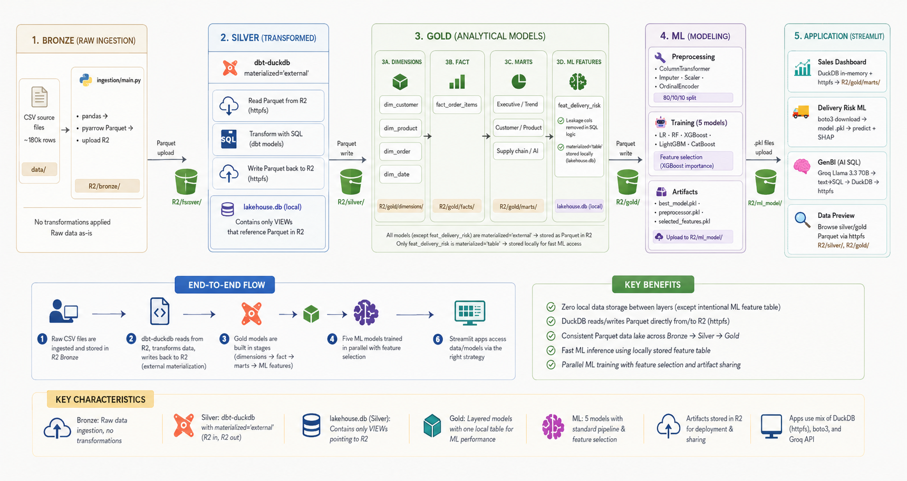

# Supply Chain Lakehouse

A modern data lakehouse for supply chain analytics — raw CSV → cloud object store → dimensional model → ML delivery-risk prediction.

## Architecture

```
data/                        Raw CSV files (DataCo Supply Chain dataset)
  └─► Bronze                 CSV → Parquet, uploaded to Cloudflare R2
        └─► Silver (dbt)     Staging / cleaning models, external Parquet on R2
              └─► Gold (dbt) Dims · Facts · Marts · ML Features in DuckDB
                    └─► ML   XGBoost delivery-risk classifier (MLflow tracking)
                          └─► Data Portal  Streamlit dashboard + prediction UI
```



| Layer | Storage | Tool |
|---|---|---|
| Bronze | Cloudflare R2 (`bronze/`) | Python + boto3 |
| Silver | Cloudflare R2 (`silver/`) | dbt-duckdb external |
| Gold — dims/facts/marts | Cloudflare R2 (`gold/`) | dbt-duckdb external |
| Gold — ML features | `lakehouse.db` (local) | dbt-duckdb table |
| ML model | `ml_app/ml_model/` + R2 (`mlflow/`) | scikit-learn + MLflow |
| Metadata / logs | Supabase PostgreSQL | supabase-py |
| MLflow tracking | Supabase PostgreSQL | MLflow 2.x |
| Orchestration | Local / Prefect | Prefect 2.x |

---

## Prerequisites

- **Python 3.11+** — [python.org/downloads](https://www.python.org/downloads/) (tick *Add to PATH*)
- **Git**
- **Cloudflare R2** — bucket named `supply-chain-ai-native`
- **Supabase** project (free tier is enough)

---

## Quick Start

### Scenario A — First time (you own the data)

```
1. Clone  →  2. Fill .env  →  3. .\setup.ps1  →  4. Run pipeline  →  5. Push to R2
```

### Scenario B — Teammate cloning (data already on R2)

```
1. Clone  →  2. Fill .env  →  3. .\setup.ps1   ← done, dashboard works immediately
```

---

## Step 1 — Clone

```powershell
git clone <repo-url>
cd supply-chain-lakehouse
```

---

## Step 2 — Create `.env`

```powershell
copy .env.example .env
```

Open `.env` and fill in all credentials:

| Variable | Where to get |
|---|---|
| `R2_ACCESS_KEY_ID` | Cloudflare Dashboard → R2 → Manage R2 API Tokens → Create Token (Read & Write) |
| `R2_SECRET_ACCESS_KEY` | same token page |
| `R2_ENDPOINT_URL` | `https://<account_id>.r2.cloudflarestorage.com` |
| `R2_BUCKET_NAME` | `supply-chain-ai-native` (default) |
| `SUPABASE_URL` | Supabase Dashboard → Settings → API |
| `SUPABASE_KEY` | Supabase Dashboard → Settings → API → `anon public` key |
| `SUPABASE_DB_URL` | Supabase Dashboard → Settings → Database → Connection string (URI) |

---

## Step 3 — Run setup script

One command installs everything and gets the project ready to run.

```powershell
.\setup.ps1
```

> If PowerShell blocks the script, run this once first:
> ```powershell
> Set-ExecutionPolicy -ExecutionPolicy RemoteSigned -Scope CurrentUser
> ```

The script runs these steps automatically:

| Step | Action |
|---|---|
| 1 | Check Python ≥ 3.11 is installed |
| 2 | Install all packages from `requirements.txt` (system Python, no venv) |
| 3 | Check `.env` exists and all required variables are filled |
| 4 | Generate `~/.dbt/profiles.yml` from `.env` (DuckDB + R2 credentials) |
| 5 | Create 5 Supabase tables for logging and metadata (idempotent) |
| 6 | Download `lakehouse.db` + ML model from R2 *(if already pushed by teammate)* |
| 7 | Run `verify_system.py` — health check for all layers |

Expected output at end of setup:

```
[OK]  Environment vars
[OK]  R2 connectivity
[OK]  Supabase
[OK]  DuckDB gold
[OK]  ML artifacts      ← only if push_lakehouse.py was run before
[SKIP] MLflow server    ← normal, start it separately if needed
```

---

## Step 4 — Run the pipeline (Scenario A only)

> Skip this step if you are a teammate cloning an existing project — `setup.ps1` already downloaded everything from R2.

### Full run (bronze → silver → gold)

```powershell
python orchestration/pipeline.py
```

### Gold only (bronze data already on R2)

```powershell
python orchestration/pipeline.py --gold-only
```

### Gold + train ML model

```powershell
python orchestration/pipeline.py --gold-only --with-ml
```

### All pipeline flags

| Flag | Effect |
|---|---|
| *(no flags)* | bronze → silver → gold |
| `--no-bronze` | skip ingestion, run silver + gold |
| `--silver-only` | silver only |
| `--gold-only` | gold only |
| `--with-ml` | include ML feature models + train classifier |

---

## Step 5 — Push to R2 (Scenario A only)

After the pipeline and training are done, push `lakehouse.db` + ML artifacts to R2 so teammates can clone without re-running anything:

```powershell
python scripts/push_lakehouse.py
```

What gets uploaded:

| File | R2 location |
|---|---|
| `lakehouse.db` | `R2/lakehouse/lakehouse.db` |
| `ml_app/ml_model/best_model.pkl` | `R2/ml_model/best_model.pkl` |
| `ml_app/ml_model/preprocessor.pkl` | `R2/ml_model/preprocessor.pkl` |
| `ml_app/ml_model/selected_features.pkl` | `R2/ml_model/selected_features.pkl` |
| `ml_app/ml_model/all_original_features.pkl` | `R2/ml_model/all_original_features.pkl` |

> After this, any teammate running `.\setup.ps1` will download these files automatically at Step 6 — no pipeline run, no model training required.

---

## Train ML model (standalone)

After gold has run at least once and `feat_delivery_risk` exists in `lakehouse.db`:

```powershell
python ml_app/train_model.py
```

Artifacts saved to `ml_app/ml_model/`:

| File | Description |
|---|---|
| `best_model.pkl` | Best model (XGBoost by default) |
| `preprocessor.pkl` | ColumnTransformer (imputer + scaler + encoder) |
| `selected_features.pkl` | Feature names after importance filtering |
| `all_original_features.pkl` | Full original feature list |
| `results.csv` | Comparison table of all 5 models |

Then push to R2:
```powershell
python scripts/push_lakehouse.py
```

---

## MLflow tracking server (optional)

MLflow uses **Supabase PostgreSQL** as backend store and **Cloudflare R2** as artifact store. The Model Registry is shared — anyone with the same `.env` sees the same experiments.

Open a **separate terminal** and keep it running:

```powershell
.\scripts\start_mlflow_server.ps1
```

UI: [http://localhost:5000](http://localhost:5000)

> Requires `SUPABASE_DB_URL` in `.env`. If not set, the pipeline still works — MLflow logging is skipped gracefully.

---

## Data Portal

```powershell
streamlit run data_portal/app.py
```

UI: [http://localhost:8501](http://localhost:8501)

| Page | Description |
|---|---|
| Executive Summary | KPIs, revenue, delivery trends |
| Sales Dashboard | Product & category performance |
| Delivery Risk | Single + batch ML prediction, SHAP explainability |
| ML Registry | MLflow model versions, metrics history |
| Data Catalog | Metadata of all layers |
| Pipeline Monitor | Supabase run logs |
| GenBI — Hỏi đáp AI | Hỏi bằng tiếng Việt, AI tự viết SQL và truy vấn data warehouse (Groq) |

---

## Running multiple services

```
Terminal 1 (keep open):  .\scripts\start_mlflow_server.ps1
Terminal 2 (keep open):  streamlit run data_portal/app.py
Terminal 3 (one-shot):   python orchestration/pipeline.py --gold-only --with-ml
```

---

## Project structure

```
supply-chain-lakehouse/
├── data/                        Raw CSV source files
├── ingestion/                   Bronze ingestion (CSV → R2 Parquet)
├── supply_chain_dbt/            dbt project (silver + gold models)
│   └── models/
│       ├── bronze/              Source references
│       ├── silver/              Staging / cleaning (external on R2)
│       └── gold/
│           ├── dimensions/      dim_customer, dim_order, dim_product, dim_date
│           ├── facts/           fact_order_items
│           ├── marts/           Executive summary, trend, AI monitoring
│           └── ml/features/     feat_delivery_risk (in lakehouse.db)
├── ml_app/
│   ├── train_model.py           Train + evaluate 5 models, log to MLflow
│   ├── mlflow_setup.py          MLflow config constants
│   └── ml_model/                Saved artifacts (gitignored)
├── orchestration/
│   ├── pipeline.py              Main Prefect flow
│   └── tasks/                   bronze / silver / gold / ml tasks
├── data_portal/
│   ├── app.py                   Streamlit entry point
│   └── pages/
│       ├── data_preview.py      Data preview
│       ├── sales_dashboard.py   Sales analytics
│       ├── ml_delivery_risk.py  ML prediction + SHAP
│       └── genbi.py             GenBI — Natural language → SQL (Groq)
├── scripts/
│   ├── push_lakehouse.py        Upload lakehouse.db + ML artifacts to R2
│   ├── pull_lakehouse.py        Download lakehouse.db + ML artifacts from R2
│   ├── start_mlflow_server.ps1  Start MLflow with R2 + Supabase
│   └── verify_system.py         Health check for all layers
├── setup.ps1                    Windows setup script (no venv, system Python)
├── setup.sh                     Linux/macOS setup script
├── requirements.txt
├── .env.example                 Credential template
└── .env                         Your credentials (gitignored)
```

---

## Tech stack

| Component | Technology |
|---|---|
| Data storage | Cloudflare R2 (S3-compatible) |
| Query engine | DuckDB |
| Transformation | dbt-duckdb |
| Metadata store | Supabase (PostgreSQL) |
| Orchestration | Prefect 2.x |
| ML training | scikit-learn, XGBoost, LightGBM, CatBoost |
| ML tracking | MLflow 2.x |
| Dashboard | Streamlit + Plotly |
| Explainability | SHAP |
